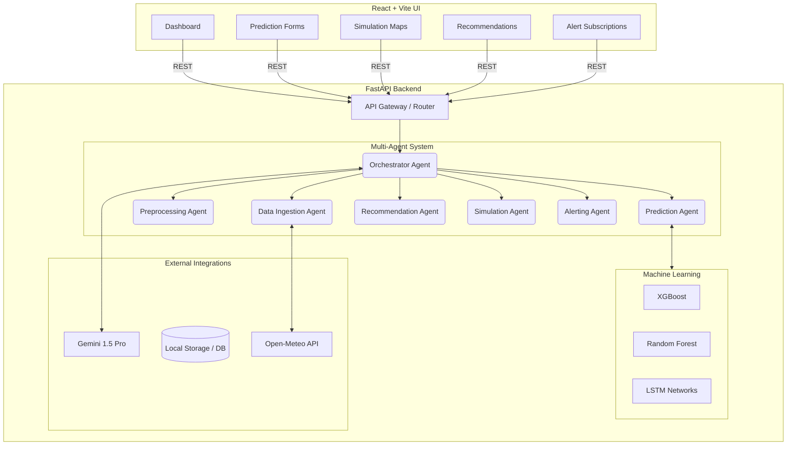
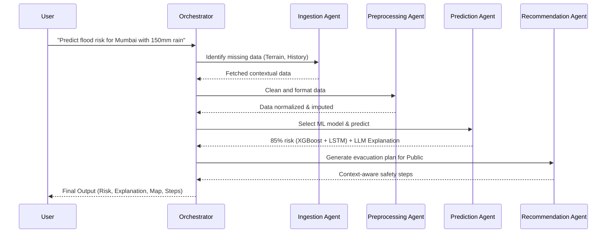

# 🌊 FloodSense AI – Comprehensive Project Report

## 1. Executive Summary
**FloodSense AI** is a state-of-the-art, **Agentic Artificial Intelligence System** designed for end-to-end flood prediction, simulation, and emergency alerting. Moving beyond static machine learning pipelines, FloodSense utilizes a Multi-Agent System (MAS) powered by Gemini 1.5 Pro to autonomously orchestrate data ingestion, select preprocessing strategies, execute ensemble machine learning models, and dynamically compile location-specific evacuation recommendations. 

The accompanying frontend is a highly responsive, modern React application featuring a glassmorphism design, real-time interactive mapping (via Leaflet), and an intuitive dashboard for both general public and emergency authority users.

---

## 2. High-Level System Architecture

The project follows a decoupled client-server architecture, cleanly separating the React frontend from the FastAPI/Python backend, while maintaining a robust communication layer via REST APIs.

---

## 3. Agentic Backend Capabilities 🧠

The defining feature of FloodSense AI is its **Agentic Backend**. It is not a rigid procedural script; rather, it is a dynamic network of autonomous agents directed by an LLM orchestrator.

### 3.1. The Agent Orchestration Flow

### 3.2 Detailed Agent Roles

1.  **Orchestrator Agent (`orchestrator.py`):** The master planner. It interprets the raw user intent, breaks it down into sub-tasks, and routes execution to the appropriate specialized agents. It maintains conversational memory to string together complex, multi-step scenarios.
2.  **Data Ingestion Agent (`ingestion_agent.py`):** Dynamically decides which external APIs (like Open-Meteo for rainfall, or Topographic datasets) need to be queried based on the geographic location requested. Uses LLMs to infer the schema of unstructured CSV uploads.
3.  **Preprocessing Agent (`preprocessing_agent.py`):** Uses an LLM to evaluate the dataset's statistical profile and dynamically selects cleaning strategies (e.g., deciding whether to use mean-imputation, linear interpolation, or row-dropping for missing sensor data).
4.  **Prediction Agent (`prediction_agent.py`):** Acts as the bridge between the LLM and hard mathematics. It evaluates the clean data, selects the best mathematical model (XGBoost, Random Forest, or LSTM for time-series), executes the inference, and then uses the LLM to generate a natural language explanation of *why* the model made its decision based on feature importances.
5.  **Recommendation Agent (`recommendation_agent.py`):** Takes the flood probability and user profile (General Public vs. Emergency Authority) and generates highly contextual, location-specific actionable steps (e.g., dispatching NDRF teams vs. moving to higher ground).
6.  **Simulation Agent (`simulation_agent.py`):** Translates "What-If" natural language queries (e.g., "What if a dam breaches?") into numerical simulation parameters, mapping the output into GeoJSON spatial data for the frontend to render.
7.  **Alerting Agent (`alerting_agent.py`):** Autonomously monitors threat thresholds and drafts contextual SMS/Email copy tailored to the severity of the event.

---

## 4. Frontend Application Architecture 🎨

The frontend is built using **React** and **Vite**, focusing on high performance, reusability, and a stunning modern visual aesthetic. 

### 4.1 Design System & UI/UX
The UI leverages a bespoke **Dark Glassmorphism** design language implemented entirely in vanilla CSS (`styles/index.css`) via CSS variables. This ensures zero reliance on heavy CSS frameworks while delivering premium aesthetics:
- Deep dark backgrounds (`#060b14`) 
- Vibrant neon accents (Sky Blue, Indigo, Emerald for safety, Rose for critical alerts)
- Frost/blur background backdrops (`backdrop-filter: blur()`)
- Subdued pulse and slide-up animations for smooth component mounting

### 4.2 Core Pages & Components

| Page / Route | Primary Purpose | Key Components |
| :--- | :--- | :--- |
| **Dashboard** (`/`) | High-level overview of system health and active alerts. | `StatCard`, Region Risk Bar Chart, Active Alerts Panel |
| **Prediction** (`/predict`) | Input location/sensor data to get immediate risk assessments. | `PredictionForm`, `PredictionResult` (Gauge Chart, Model Badges, LLM Explanation) |
| **Simulation** (`/simulation`) | Run "What-if" scenarios and view temporal/spatial impacts. | `ScenarioForm`, `SimulationChart` (Recharts), `FloodMap` (Leaflet) |
| **Recommendations** (`/recommendations`)| View LLM-generated safety and logistical steps based on risk. | User-type toggle, `RecommendationList`, SMS Preview Cards |
| **Alerts** (`/alerts`) | Manage emergency communications and user subscriptions. | `AlertSubscribe`, `AlertList` (Tabs, Tables) |

### 4.3 Key Frontend Technologies
- **Routing:** `react-router-dom` for seamless SPA transitions.
- **Mapping:** `leaflet` and `react-leaflet` to render OpenStreetMap/CartoDB tiles and overlay dynamic GeoJSON flood inundation zones.
- **Data Visualization:** `recharts` for rendering complex simulation timelines (water level vs. rainfall over time).
- **API Client:** `axios` configured with interceptors for robust error handling and backend communication mapping.

---

## 5. Extensibility & Future Roadmap

FloodSense AI is designed with modularity at its core. Future extensions require minimal refactoring:
1.  **New Models:** Adding a new ML model simply requires creating a new wrapper in `backend/agents/prediction/models/` and updating the LLM prompt in the `ModelSelector`.
2.  **New Data Sources:** New scrapers (e.g., satellite imagery) can be dropped into the `fetchers/` directory; the Data Ingestion Agent will automatically learn to use them via updated prompt context.

---

## 6. Frontend UI Walkthrough

Since the LLM and DB backend environment variables are unconfigured, the frontend gracefully degrades to "Backend Offline" mode while preserving the UI architecture. 

### 6.1 Dashboard
The main command center monitoring API health, regional risk metrics, and active system alerts.

### 6.2 AI Prediction Pipeline
The interface where users input live sensor data, triggering the XGBoost/LSTM models and generating the Gemini safety explanation.

### 6.3 Flood Simulation Mapping
Interactive leaflet mapping allowing users to visually simulate customized synthetic flood scenarios (e.g., dam breaks).

### 6.4 Contextual Recommendations
Displays dynamic emergency steps and resource allocation strategies tailored to whether the user is a civilian or government official.

### 6.5 Alerting Management
Hub for managing SMS/Email subscriptions and reviewing the history of automated LLM-generated safety broadcasts.

*End of Document*
